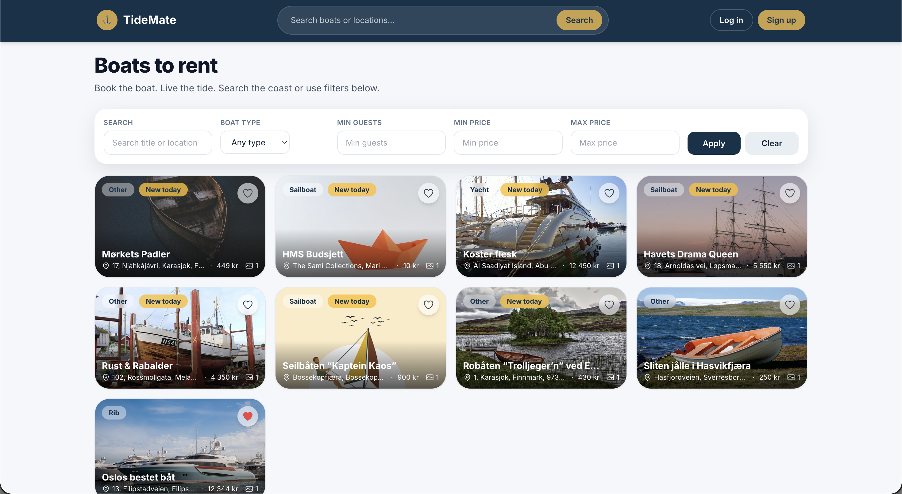
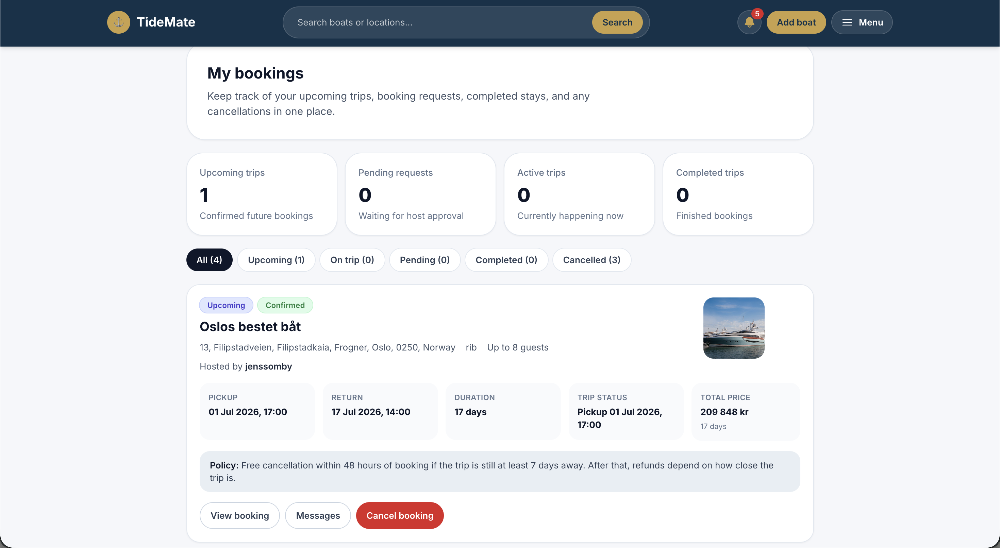
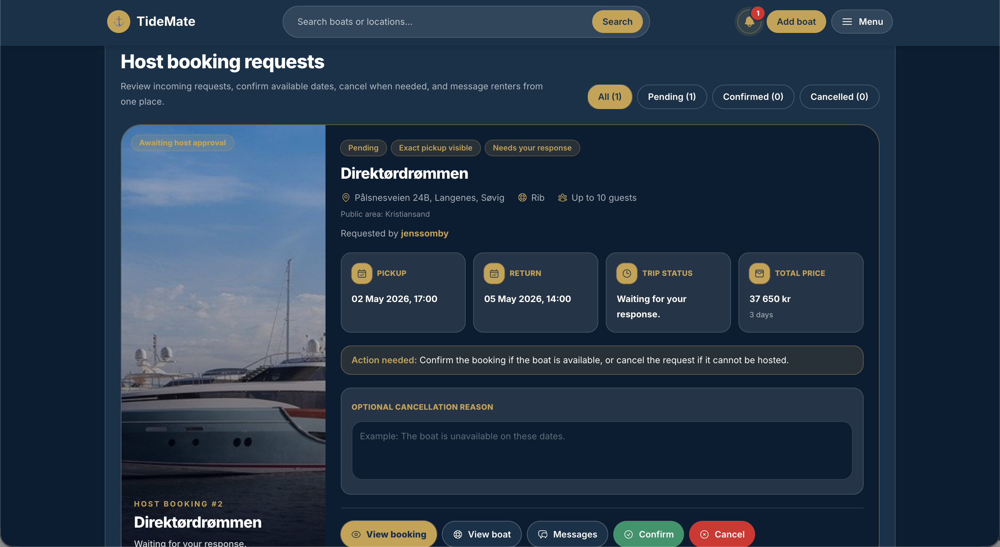

# TideMate

TideMate is a full-stack Boatbnb-style marketplace for boat listings, bookings, favorites, reviews, chat, and notifications.

NB: This project is under active development and was built as a student/portfolio project. Some features are still being improved.

## Stack

- Frontend: React, Vite, React Router, Tailwind CSS, Axios, Leaflet
- Backend: Django, Django REST Framework, SimpleJWT, Channels

## Project structure

- `frontend/` – React app
- `backend/` – Django API

## Features

- User registration, login, logout, and email verification
- Boat listing creation and editing for hosts
- Booking flow for renters
- Favorites system
- Reviews for boats/users
- Real-time chat with Django Channels/WebSockets
- Real-time notifications
- Search and filtering
- Responsive React frontend

## Screenshots

### Homepage


### My bookings


### Host bookings


## Security
- httpOnly cookies
- CSRF protection
- permissions
- image validation
- session handling

## Clean local setup

This project is set up for local development with a Vite dev proxy so the browser can call `/api/...` on the frontend origin and Vite forwards those requests to Django at `http://localhost:8000`.

That avoids the common local CSRF failure caused by mixing `localhost` and `127.0.0.1`.

### 1) Backend

Create and activate a virtual environment, then install dependencies:

```bash
cd backend
python -m venv .venv
source .venv/bin/activate
pip install -r requirements.txt
cp .env.example .env
python manage.py migrate
python manage.py runserver localhost:8000
```

### 2) Frontend

```bash
cd frontend
cp .env.example .env
npm install
npm run dev
```

Open the app in the browser from the Vite URL, usually `http://localhost:5173`.

## Local development notes

- Keep Django on `http://localhost:8000`, not `http://127.0.0.1:8000`.
- The frontend now defaults to `/api`, which uses the Vite proxy in development.
- You normally do not need to set `VITE_API_BASE_URL` locally.
- If you do override `VITE_API_BASE_URL`, use `http://localhost:8000/api` so CSRF cookies and requests stay on compatible hosts.

## Production notes

- Move away from SQLite to PostgreSQL using `DATABASE_URL`
- Replace the development secret key
- Replace the in-memory channel layer with Redis
- Set `DEBUG=False`
- Configure `ALLOWED_HOSTS`, CORS, CSRF trusted origins, and secure cookie settings
